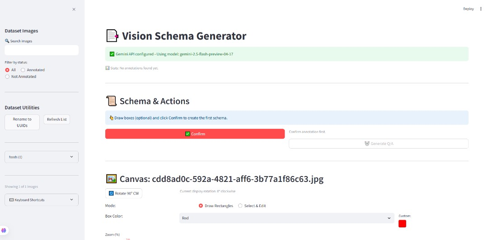

# Vision Schema Generator

A Streamlit-based application for annotating images with bounding boxes and generating bilingual question-answer pairs using Google's Gemini AI for vision language model training.



## Features

- 📂 **Hierarchical file explorer** for navigating your image dataset
- 🖌️ **Interactive canvas** for drawing, moving, and resizing bounding boxes 
- 📊 **Live coordinate readout** for precise annotations
- 🤖 **AI-assisted Q/A generation** with Gemini AI
- 📝 **Schema editor** for customizing metadata and annotations
- 🔄 **Image rotation** for better annotation angles
- 🔍 **Zoom in/out** to see details or entire image
- 🔍 **Search and filter** capabilities for quick navigation
- 🆔 **Batch renaming** to UUIDs for better tracking

## Installation

### Prerequisites

- Python 3.9+
- Dataset of images to annotate
- Google Gemini API key

### Setup

1. Clone this repository:
   ```bash
   git clone https://github.com/yourusername/vision-schema-generator.git
   cd vision-schema-generator
   ```

2. Create and activate a virtual environment:
   ```bash
   python -m venv venv
   
   # On Windows
   venv\Scripts\activate
   
   # On macOS/Linux
   source .venv/bin/activate
   ```

3. Install dependencies:
   ```bash
   pip install -r requirements.txt
   ```

4. Create a `.env` file with your Gemini API key:
   ```
   GEMINI_API_KEY=your_api_key_here
   GEMINI_MODEL=gemini-pro-vision
   DEBUG_VISION_SCHEMA=0
   DEFAULT_LOCAL_LANGUAGE=local
   ```
   
   You can get a Gemini API key from [Google AI Studio](https://makersuite.google.com/app/apikey).

5. Prepare your dataset:
   - Create a `dataset` folder in the project root
   - Organize images into subdirectories by category (e.g., `dataset/Food/Japanese/img_001.jpg`)

## Usage

Start the application:
```bash
streamlit run main.py
```

### Basic Workflow

1. **Enter your Gemini API key** (either in the UI or in the `.env` file)
2. **Select an image** from the sidebar file explorer
3. **Choose a color** for your bounding boxes using the dropdown or color picker
4. **Draw bounding boxes** on the canvas (optional)
5. Click **✅ Confirm** to save the annotation
6. Click **🤖 Generate Q/A** to create AI-generated question-answer pairs
7. Select a Q/A pair from the generated options
8. Edit the schema if needed using the **Edit Schema Values** expander

## Command Line Scripts

The application includes two command-line scripts for batch operations:

### Bulk Schema Validation

Validates all schema files in your dataset to ensure they follow the correct format:

```bash
python scripts/bulk_validate.py
```

This script will check every schema file and report any validation errors.

### Batch UUID Renaming

Renames all images to UUID-based filenames and updates corresponding annotations:

```bash
python scripts/rename_uuid.py
```

> ⚠️ **WARNING**: This operation cannot be easily undone. Always back up your dataset before using this feature.

## Features in Detail

### Drawing Bounding Boxes

The canvas provides an interactive way to draw and edit bounding boxes:

- **Draw Mode**: Click and drag to create new boxes
- **Transform Mode**: Select and modify existing boxes
- **Color Selection**: Choose colors for different types of annotations
- **Zoom Control**: Zoom in/out of the image for precise annotations
- **Coordinate Display**: View the exact coordinates of each box

### AI-Generated Question-Answer Pairs

Gemini AI can generate multiple types of question-answer pairs:

- **Captioning**: Simple descriptions of what's in the image
- **VQA (Visual Question Answering)**: More complex questions about the image
- **Instruction**: Instruction-following prompts related to the image

Each Q/A pair includes:
- Questions and answers in both English and a local language
- Difficulty rating (easy, medium, hard)
- Language quality score
- Optional tags

### File Management

The application organizes annotations following your dataset structure:

- **annotated_dataset/annotated_[category]/...**: Images with drawn boxes
- **annotated_dataset/schema_[category]/...**: JSON annotation files

For example:
```
- dataset/
  - Food/
    - Japanese/
      - img_001.jpg
- annotated_dataset/
  - annotated_Food/
    - Japanese/
      - img_001.jpg
  - schema_Food/
    - Japanese/
      - img_001.json
```

### Data Format

The schema follows a standardized format:

```json
{
  "image_id": "img_001",
  "image_path": "dataset/Food/Japanese/img_001.jpg",
  "task_type": "vqa",
  "text_en": "What dish is shown in the image?",
  "text_local": "ภาพนี้แสดงอาหารอะไร?",
  "answer_en": "The image shows sushi rolls with salmon and avocado.",
  "answer_local": "ภาพนี้แสดงซูชิโรลกับแซลมอนและอะโวคาโด",
  "difficulty": "medium",
  "bounding_box": [
    [[100, 150], [300, 150], [300, 250], [100, 250]]
  ],
  "language": {
    "source": ["local", "en"],
    "target": ["local", "en"]
  },
  "tags": ["food", "japanese", "sushi"],
  "metadata": {
    "license": "CC-BY",
    "annotator_id": "a001",
    "language_quality_score": 4.5,
    "timestamp": "2025-04-25T15:30:45.123456"
  }
}
```

## Environment Variables

You can customize the application behavior with these environment variables:

- `GEMINI_API_KEY` - Your Gemini API key (can also be entered in the UI)
- `GEMINI_MODEL` - Gemini model to use (default: "gemini-pro-vision") 
- `DEBUG_VISION_SCHEMA` - Set to "1" for verbose logging (default: "0")
- `DEFAULT_LOCAL_LANGUAGE` - Set default local language code (default: "local")

## Project Structure

```
vision_schema_generator/
├── main.py                 # Main application entry point
├── requirements.txt        # Project dependencies
├── .env.template           # Template for environment variables
├── README.md               # Documentation
├── components/             # UI components
│   ├── sidebar.py          # File explorer
│   ├── canvas_box.py       # Drawing canvas
│   ├── json_viewer.py      # Schema editor
│   └── qa_selector.py      # Q/A pair selector
├── utils/                  # Utility functions
│   ├── file_utils.py       # File operations
│   ├── schema_utils.py     # Schema definition & validation
│   ├── gemini_api.py       # Gemini API integration
│   ├── env_utils.py        # Environment variables
│   └── logger.py           # Logging configuration
├── constants/              # Application constants
│   └── prompts.py          # Gemini system prompts
└── scripts/                # Command-line scripts
    ├── bulk_validate.py    # Validate all schemas
    └── rename_uuid.py      # Batch rename to UUIDs
```

## Troubleshooting

### API Key Issues

- Error: "Gemini API key must be provided"
  - Ensure you've entered your API key in the UI or in the `.env` file
  - Verify the API key is valid and active

### Image Loading Problems

- If images fail to load, check:
  - File formats (supported: jpg, jpeg, png, webp, gif, bmp, tiff, heic, heif)
  - Image paths don't contain special characters
  - Install pillow-heif for HEIC/HEIF support: `pip install pillow-heif`

### Gemini API Errors

- "API request failed..."
  - Verify your internet connection
  - Check your API key and quota limits
  - Try a different Gemini model

## License

This project is licensed under the MIT License - see the LICENSE file for details.

## Acknowledgments

- Built with [Streamlit](https://streamlit.io/)
- Powered by [Google Gemini AI](https://gemini.google.com/)
- Uses [streamlit-drawable-canvas](https://github.com/andfanilo/streamlit-drawable-canvas) for annotation capabilities

---

*Vision Schema Generator is an open-source project designed to simplify the process of building high-quality vision-language datasets.*
*Any questions can directly contact author-Liu *
*Email: rexliu2004@163.com*
